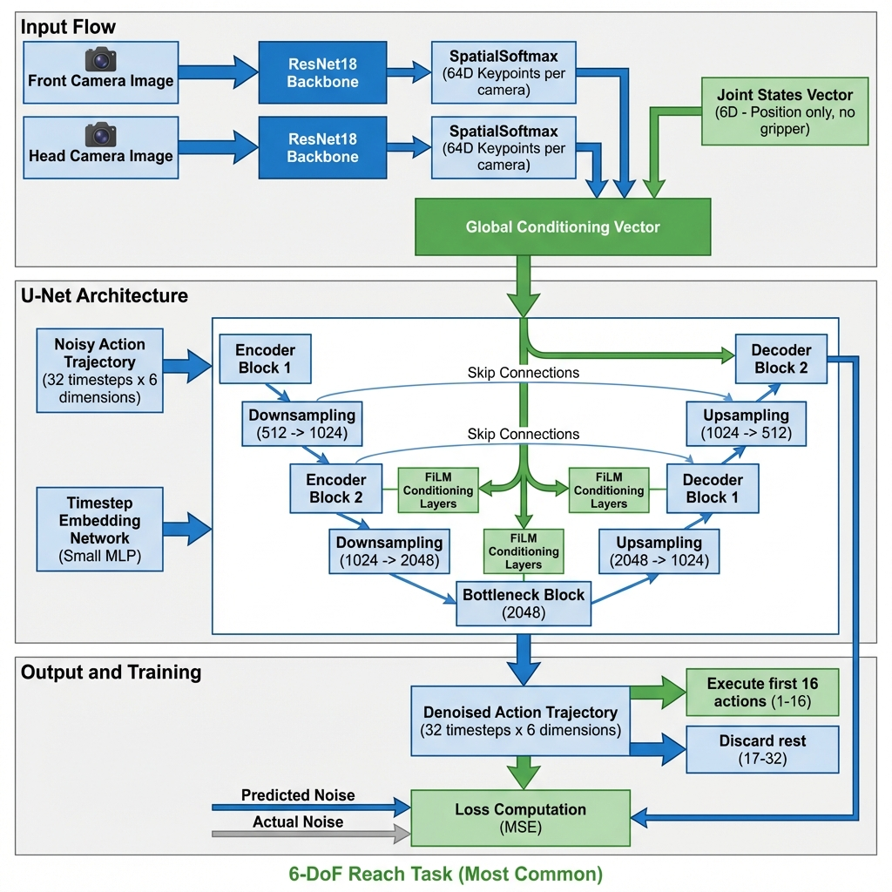
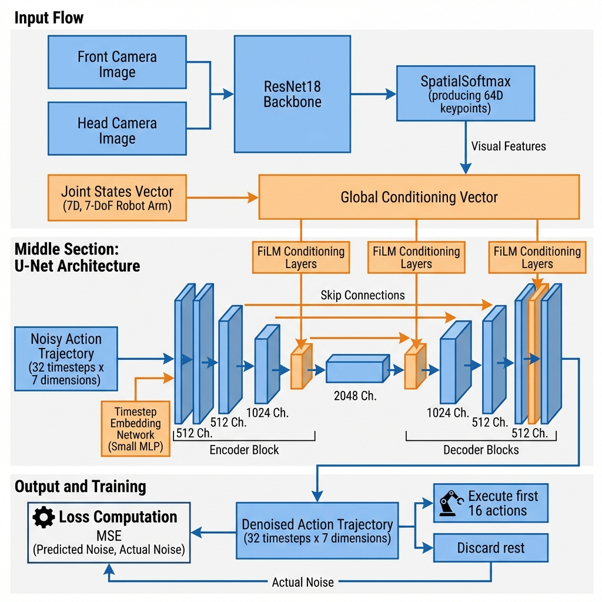
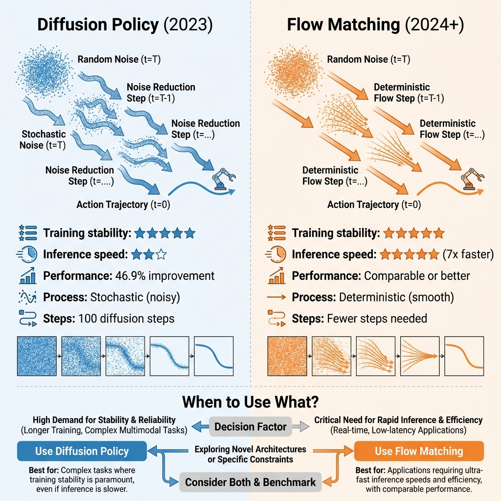

# Diffusion Policy Study Guide

Complete learning resource for understanding and implementing Diffusion Policy in LeRobot.

## 📖 Study Guide Sections

```{toctree}
:maxdepth: 2
:caption: Study Guide

study_guide_overview
study_guide_deep_dive
study_guide_code_walkthrough
study_guide_papers
training_ur10e_picknplace_7dof
```

## Overview

This study guide provides comprehensive documentation for learning Diffusion Policy from theory to implementation. Whether you're a beginner trying to understand the basics or an advanced user looking to implement your own modifications, these guides will help you master the technique.

### What You'll Learn

- **Theory**: Understanding diffusion models and how they apply to robotics
- **Implementation**: Deep dive into the LeRobot codebase
- **Practice**: Hands-on experiments you can run
- **Advanced**: Flow matching and other successor techniques

## Quick Start

If you're new to Diffusion Policy, we recommend this learning path:

1. **Week 1**: Start with {doc}`study_guide_overview` for the big picture
2. **Week 2**: Read {doc}`study_guide_deep_dive` for detailed explanations
3. **Week 3**: Work through {doc}`study_guide_code_walkthrough` 
4. **Week 4**: Explore {doc}`study_guide_papers` for research context

## Study Guide Contents

### {doc}`study_guide_overview`
- 4-week structured learning path
- Hands-on experiments
- Week-by-week checkpoints
- Debugging tips and troubleshooting

### {doc}`study_guide_deep_dive`
- Paper background and key insights
- **Detailed explanation of every training argument**
- Successor techniques (Flow Matching)
- Architecture concepts
- Advanced topics

### {doc}`study_guide_code_walkthrough`
- Line-by-line code explanations
- Annotated examples
- Training loop breakdown
- Inference loop breakdown
- Key functions explained

### {doc}`study_guide_papers`
- Complete paper list with arXiv links
- Recommended reading order
- Quick summaries
- Download commands

## Visual Resources

### Architecture Diagrams

We provide architecture diagrams for both configurations:


*Figure 1: **6-DoF Reach Task Architecture** (most common setup). Shows data flow for a 6-DoF robot arm without gripper control. State and action dimensions are 6.*


*Figure 2: **7-DoF Pick-and-Place Architecture** (with gripper). Shows data flow for a 7-DoF robot arm including gripper control. State and action dimensions are 7.*

### Comparison Chart


*Figure 3: Comparison between Diffusion Policy and Flow Matching approaches, highlighting their differences in training stability, inference speed, and use cases.*

## Quick Reference: Training Commands

### 6-DoF Reach Task (Most Common)

Typical training command for 6-DoF robot arms (reach-like tasks):

```bash
python3 -m [lerobot.scripts.train](../lerobot/scripts/train.py) \
    --dataset.repo_id plating_6dof \
    --dataset.root /mnt/nas/dataset/robot_learning/lerobot/plating_6dof \
    --policy.type diffusion \
    --policy.horizon 32 \           # Predict 32 future actions
    --policy.n_action_steps 16 \    # Execute first 16 (receding horizon)
    --policy.n_obs_steps 2 \        # Use 2 past observations
    --policy.crop_shape "null" \    # No image cropping
    --policy.vision_backbone resnet18 \
    --policy.device cuda \
    --batch_size 64 \               # Larger batch for 6DoF (less memory)
    --num_workers 4 \
    --wandb.enable True \
    --wandb.project plating_6dof \
    --wandb.entity shennongshi \
    --job_name diffusion_baseline \
    --output_dir /mnt/nas/models/plating_6dof/diffusion/baseline
```

**Configuration**: 6-DoF arm, no gripper, `obs.state` and `action` shapes are `(6,)`

### 7-DoF Pick-and-Place (With Gripper)

For tasks requiring gripper control (e.g., pick-and-place):

```bash
python3 -m [lerobot.scripts.train](../lerobot/scripts/train.py) \
    --dataset.repo_id picknplace_7dof_normal \
    --dataset.root /mnt/nas/dataset/robot_learning/lerobot/picknplace_7dof_normal \
    --policy.type diffusion \
    --policy.horizon 32 \
    --policy.n_action_steps 16 \
    --policy.n_obs_steps 2 \
    --policy.crop_shape "null" \
    --policy.vision_backbone resnet18 \
    --policy.device cuda \
    --batch_size 16 \               # Smaller batch if memory-constrained
    --num_workers 2 \
    --wandb.enable True \
    --wandb.project picknplace_7dof_normal \
    --wandb.entity shennongshi \
    --job_name diffusion_baseline \
    --output_dir /mnt/nas/models/picknplace_7dof/diffusion/baseline
```

**Configuration**: 7-DoF arm with gripper, `obs.state` and `action` shapes are `(7,)`

For detailed explanation of every argument, see {doc}`study_guide_deep_dive`.

## Key Concepts

### What is Diffusion Policy?

Diffusion Policy reframes robot policy learning as a **conditional denoising diffusion process**:

1. **Training**: Learn to predict noise added to action trajectories
2. **Inference**: Start with random noise, iteratively denoise to get clean actions
3. **Result**: 46.9% improvement over prior state-of-the-art methods

### Why Diffusion?

- ✅ **Multimodal distributions**: Handles multiple valid action sequences
- ✅ **High-dimensional actions**: Works with complex robot manipulators  
- ✅ **Training stability**: More stable than GANs or VAEs
- ✅ **Robustness**: Resilient to perturbations and visual distractions

### Receding Horizon Control

The key innovation that makes Diffusion Policy practical:

- **Predict**: Generate `horizon` timesteps of actions (e.g., 32)
- **Execute**: Only use first `n_action_steps` (e.g., 16)
- **Re-plan**: Generate new trajectory from updated observations
- **Benefit**: Smooth, consistent actions with long-term context

## Getting Started

### Prerequisites

- Basic understanding of deep learning
- Familiarity with PyTorch
- Knowledge of robot kinematics (helpful but not required)

### Recommended Background Reading

If you're new to diffusion models, these resources will help:

1. **Lil'Log Blog**: ["What are Diffusion Models?"](https://lilianweng.github.io/posts/2021-07-11-diffusion-models/)
2. **Hugging Face Blog**: Introduction to Diffusion Models
3. **YouTube**: Search for "Diffusion Models Explained"

## Learning Paths

### Path 1: Quick Start (1 week)
- Read {doc}`study_guide_overview`
- Focus on "Training Arguments" in {doc}`study_guide_deep_dive`
- Run the overfit experiment
- Start training on your dataset

### Path 2: Comprehensive (4 weeks)
- Follow the full 4-week plan in {doc}`study_guide_overview`
- Read all papers in {doc}`study_guide_papers`
- Complete all experiments
- Implement modifications

### Path 3: Code-First (2 weeks)
- Start with {doc}`study_guide_code_walkthrough`
- Add print statements and explore
- Read theory as needed
- Experiment with hyperparameters

## Next Steps

1. **Choose your learning path** above
2. **Start with** {doc}`study_guide_overview`
3. **Reference** {doc}`study_guide_deep_dive` when you need details
4. **Use** {doc}`study_guide_code_walkthrough` when coding
5. **Explore** {doc}`study_guide_papers` for research context

Good luck with your Diffusion Policy journey! 🚀🤖
